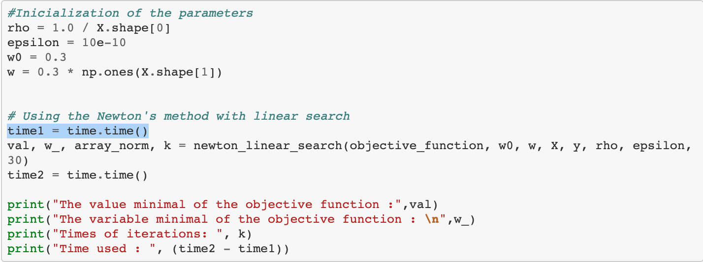
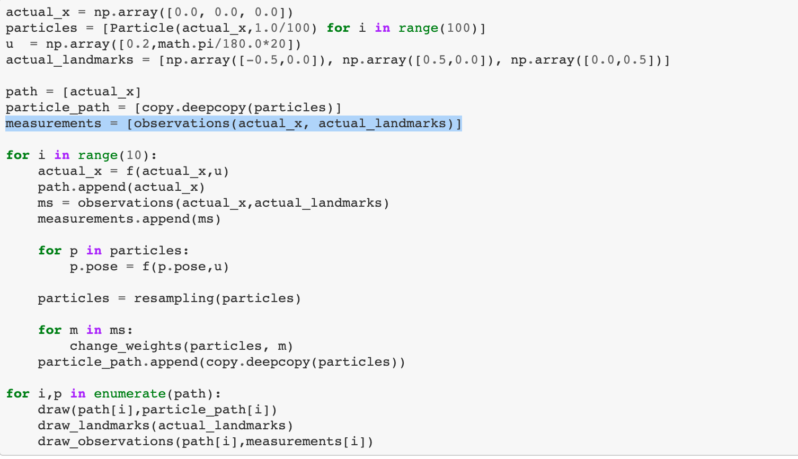
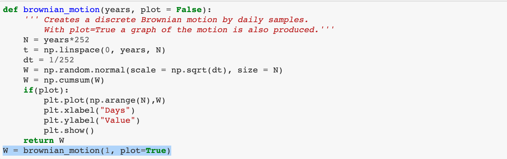

# Debugging module

The targeted failure debugging module of Osiris aims to locate the suspicious statements. Currently, it will return the line number of the firstly found suspicious statement.  

Below examples demonstrate the usage of our debugging module, where source code of notebooks are also provided.   

### Example 1

Notebook Information <br/>
GitHub source: FHainzl/SD-TSIA211 <br/>
Notebook: TP2/TP2.ipynb <br/>

```
cell index: 11
Execution order: [0, 1, 2, 3, 4, 5, 6, 7, 8, 9, 10, 11, 12, 13, 14, 15]
The potential statement for causing status difference is line 8
-------------->  time1 = time.time()
```

Part of source code (cell of which suspicious statement is detected):
    

### Example 2

Notebook Information <br/>
GitHub source: nakanodaiki/probrobo2017 <br/>
Notebook: probrob.ipynb <br/>

```
cell index: 7
Execution order: [0, 1, 2, 3, 4, 5, 6, 7]
The potential statement for causing status difference is line 7
-------------->  measurements = [observations(actual_x, actual_landmarks)]
```

Part of source code (cell of which suspicious statement is detected):
    

 ### Example 3

Notebook Information <br/>
GitHub source: bwdGitHub/Black-Scholes <br/>
Notebook: Black-Scholes.ipynb <br/>

```
cell index: 1
Execution order: [0, 1, 2, 3, 4, 5, 6, 7, 8, 9, 10, 11]
The potential statement for causing status difference is line 14
-------------->  W = brownian_motion(1, plot=True)
```

Part of source code (cell of which suspicious statement is detected):
   


